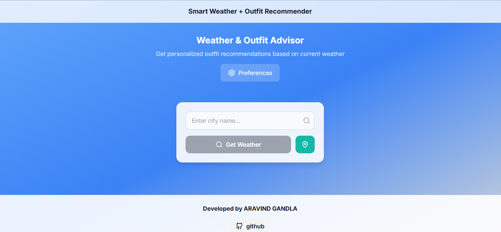
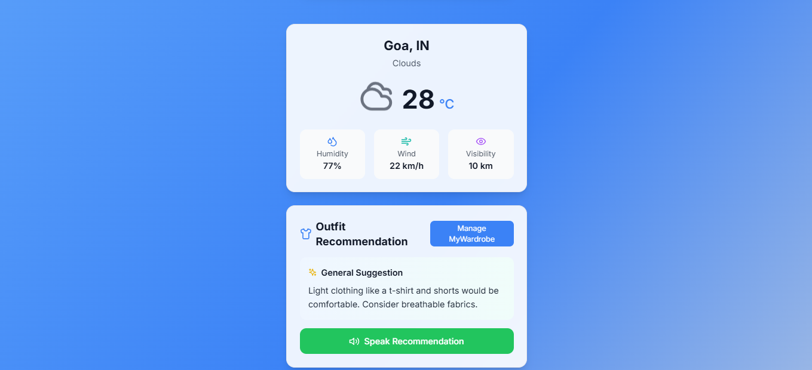
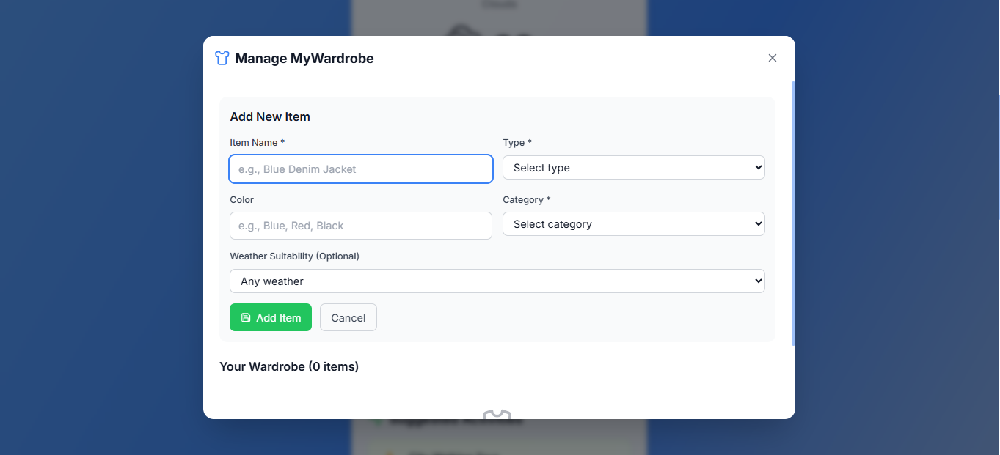
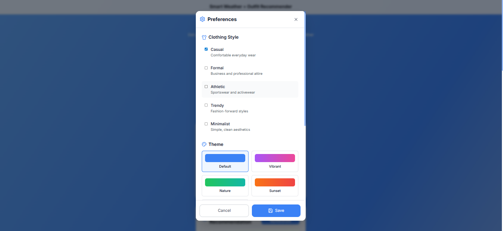
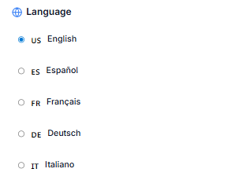
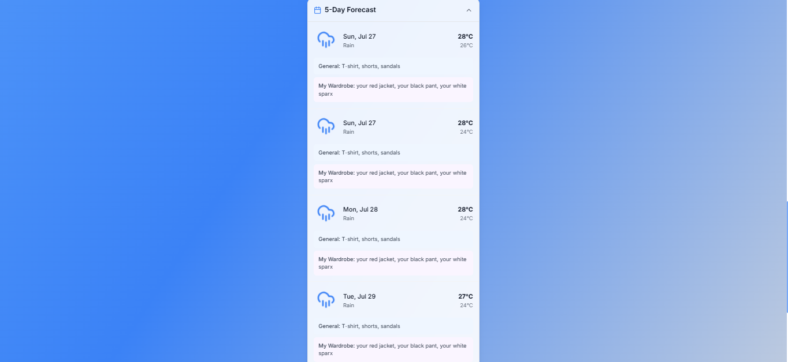

# 🌤️ Weather Outfit Recommender

A smart, personalized web app that recommends outfits and activities based on 5-day weather forecasts and your wardrobe. Customize your experience with themes, language preferences, and manage your clothing like a digital closet!

---

## 🧠 Features

- 📅 **5-Day Weather Forecast** – Accurate weather updates using OpenWeatherMap API
- 🧥 **Outfit Recommendations** – Suggests suitable outfits for daily weather
- 🧳 **Wardrobe Manager** – Add, categorize, and manage your digital closet
- 🏃 **Suggested Activities** – Recommends fun or suitable activities for the forecasted weather
- 🎨 **Theme Customization** – Switch between light/dark themes
- 🌐 **Language Preference** – Multilingual interface for diverse users

---

## 🛠️ Tech Stack

- **Frontend**: React, Tailwind CSS
- **Backend (optional)**: Node.js (if applicable)
- **API**: OpenWeatherMap API
- **Others**: LocalStorage / MongoDB (if you’re persisting wardrobe)

---

## 📸 Screenshots
SCREENSHOTS









## 🚀 Getting Started

Clone the repository and run locally:

```bash
git clone https://github.com/your-username/weather-outfit-recommender.git
cd weather-outfit-recommender
npm install
npm run dev
